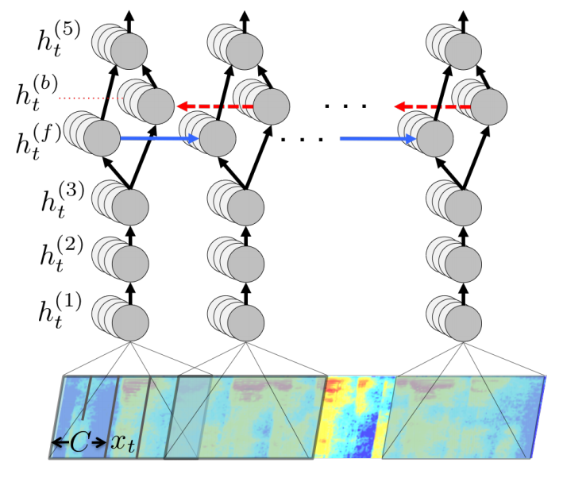
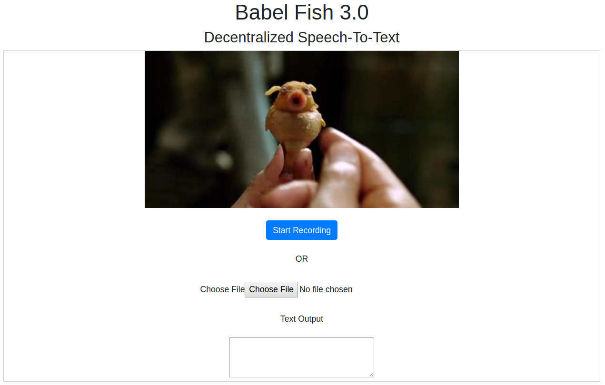

# ethberlinzwei-babelfish_3_0
EthBerlinZwei hackathon submission for a decentralized speech-to-text transcription service!

## Team 

[Marcus](https://github.com/MarcusJones) - Full stack

[Magdalena](https://github.com/mtagda) - Data Science


## Concept

Speech to text transcription is the problem tackled in this project. This is furthermore a demo and hack for generalized compute and AI services which are orchestrated, incentivized, scaled, and secured by Ethereum smart contracts! 

There exist several popular transcription services, for example, the [Google Speech-To-Text](https://cloud.google.com/speech-to-text/) API. 

But wait, are you willing to give away your sensitive audio speech files to a FANG company? What if you could be rewarded for providing your speech audio file? And what about competition and price discovery? 

Project **babelfish 3.0** envisions and enables a mobile DApp which puts the power back in your hands. 

As a user, you specify the price for your data (0 if you want to only purchase the transcription), the reward offered to the processor services, and the number of processor nodes. With these settings, your audio file is securely registered into the Ocean Protocol decentralized data registry. 

Next, the processor nodes bid on offering the requested service. The chosen processors execute the transcription task, and submit (oracalize) their results to a verifier smart contract. 

The verifier 

## Scope of the project

### Prior work, libraries, 
This project makes use of the open source [Ocean Protocol](https://oceanprotocol.com/) project to register and 'own' data assets. 

### Implemented

 * Interfacing to Ocean Protocol for *registration* of audio file via python client library. 
 * Interfacing to Ocean Protocol for *download* of audio by processors
 * Transcription of audio using the open source [DeepSpeech](https://github.com/mozilla/DeepSpeech) tensorflow library and pre-trained model.
 * Productionization of the transcription service with Flask on AWS
 * Simulation of the verifier service
 
### Not implemented / WIP

 * Verifier smart contract not programmed or deployed
 * Full end-end integration (manual walkthrough, see below)

## Project repo organization

[/frontend](/frontend) contains the angular front-end interface for the DeepSearch transcription service
[/stt](/stt) contains the development and deployment of the backend transcription service with tensorflow
[/scripts] contains the ocean protocol integration development
 
## Deep dive: Transcription service

This project employs the DeepSpeech pre-trained model for speech transcription. DeepSpeech is an open source engine, using a model trained by machine learning techniques based on [Baidu's Deep Speech research paper](https://arxiv.org/abs/1412.5567). Project DeepSpeech uses Google's [TensorFlow](https://www.tensorflow.org/) to serve predictions. 

The model is built using a Recurrent Neural Network, with the architecture presented in the figure below. 



The model API has been wrapped with Python-Flask (back-end), and presented using a simple front-end (angular). 


 
## Deep dive: End to end user story

### Step 1: Client uses mobile phone to store audio

### Step 2: Client registers audio into Ocean Protocol

```bash
python 0_publish_audio.py \
--url https://public-data-seeding.s3.eu-central-1.amazonaws.com/Test+Video+/testcoffeeshort.wav \
--price 10 \
--reward 50 \
--number-nodes 3

```

Command line API parameters;
- `--url` the url of the asset
- `--price` the demanded price to download the asset (can be 0)
- `--reward` the offered reward for the processing job
- `--number-nodes` the number of processors requested for this job

Increasing the number of processing nodes will increase the reliability of the transcription due to the voting mechanism, but can decrease the incentive for nodes to participate. 

[Youtube screencast demo - register audio](https://www.youtube.com/watch?v=cwy1cI4TBOo&feature=youtu.be)

### Step 3: Processor nodes bid on the open job, and purchase the audio asset

```bash
python 1_processor_purchase_file.py \
--did did:op:f8252ea7a645475a9c519a241112ab292ff66b7d4a2049a5862b34bcfa507c30
```

Command line API parameters;
- `--did` the Decentralized IDentifier of the registered audio asset to purchase

[Youtube screencast demo - consume audio](https://www.youtube.com/watch?v=-7aANaSw7Xs&feature=youtu.be)

### Step 4: Processor nodes transcribe the audio, and submit results for verification


### Step 5: Verification process and transmission of final text transcription


## Technical appendix: Ocean Protocol integraion


